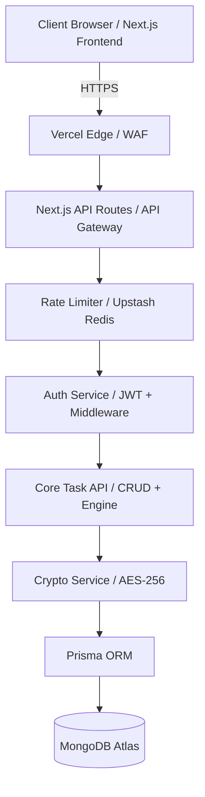

# TaskForge Architecture & Security Documentation

## 1. High-Level Architecture Diagram

## 2. Request Lifecycle Flow
1. **Client Request**: User performs an action (e.g., fetching tasks).
2. **Edge / Load Balancer**: Request is routed through Vercel's edge network.
3. **Rate Limiting**: Middleware checks the IP/User ID against rate limits.
4. **Authentication Check**: Middleware validates the HTTP-only JWT access cookie.
    - If expired, attempts to use the refresh token.
    - If valid, attaches user context to the request.
5. **Authorization (RBAC)**: Validates if the user has permission to perform the action.
6. **Controller Logic**: Next.js API route handles the specific business logic.
7. **Data Fetching/Mutation & Decryption/Encryption**:
    - Data requested from DB via Prisma.
    - Sensitive fields decrypted before sending back.
8. **Response**: JSON payload sent to the client.

## 3. Auth Token Lifecycle
- **Login**: User authenticates with email/password (bcrypt verification). Server issues `access_token` (15m expiry) and `refresh_token` (7d expiry) as HTTP-only secure cookies.
- **Access**: `access_token` validated on each request.
- **Refresh**: When `access_token` expires, the client request fails with 401. An interceptor calls `/api/auth/refresh`. The server validates `refresh_token` and issues a new `access_token` cookie.
- **Logout**: Cookies are cleared, and the refresh token is blacklisted or simply dropped depending on the strictness required.
- **Rotation**: Refresh tokens are rotated upon use to detect and prevent token theft.

## 4. Cookie Security Model
- **`HttpOnly`**: Set to `true` to mitigate XSS attacks (JS cannot read the cookie).
- **`Secure`**: Set to `true` to ensure cookies are only transmitted over HTTPS.
- **`SameSite`**: Set to `strict` or `lax` to prevent CSRF attacks.
- **Path**: Scope the cookie to `/` or specific paths as needed.

## 5. Encryption Pipeline
- **Algorithm**: AES-256-GCM.
- **Key Storage**: High-entropy secret stored in `ENCRYPTION_KEY` environment variable.
- **Process**:
    - *Write*: Before saving to DB, sensitive fields (e.g., `Task.description`) are encrypted. An Initialization Vector (IV) is generated for each encryption operation and stored alongside the encrypted data (`iv:encrypted_data` format).
    - *Read*: Upon fetching from DB, the IV is extracted, and the data is decrypted using the master key.
- **Impacted Fields**: `description`, `notes`, `attachments_metadata`.

## 6. API Gateway Pattern
We will utilize **Next.js API Routes (App Router Route Handlers)** acting as a lightweight API Gateway and BFF (Backend-For-Frontend).
The API Routes will aggregate services, format data specifically for the UI, and handle uniform error formatting, rate-limiting, and authentication termination.

## 7. Rate Limiting Layer
A sliding window rate limiting strategy implemented in Next.js Middleware.
- **Unauthenticated**: 50 req / 10 min per IP.
- **Authenticated**: 200 req / minute per User ID.
- *Technology*: In a production Next.js app on Vercel, this usually involves Upstash Redis, but for this self-contained implementation, we will mock or implement a simple memory/LRU based limiter or basic Next.js middleware headers mechanism.

## 8. RBAC Authorization Model
- **Roles**: `USER`, `ADMIN`.
- **Permissions**:
    - `USER`: `create:task`, `read:own_task`, `update:own_task`, `delete:own_task`.
    - `ADMIN`: `read:any_task`, `delete:any_task`, `manage:users`.
- **Enforcement**: Middleware or higher-order functions in the API routes that check the `role` embedded in the validated JWT against the required permissions for the route. Ownership checks are performed at the query level (`where userId = currentUserId`).
